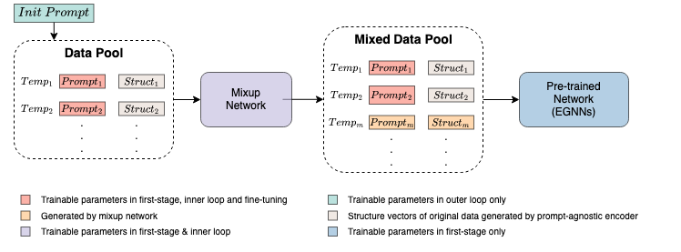

# mixup-meta-protein-simulators
[](https://arxiv.org/abs/2308.15116)

Official code release for the paper "Mixup-Augmented Meta-Learning for Sample-Efficient Fine-Tuning of Protein Simulators".


## Environment
Install the required packages from `requirements.txt`.
```bash
pip install -r requirements.txt
```
## Get Data
Run `collect_diff_temp_chignolin.py` to get the trajectories under different temperature.  <br> 
As in our settings, you will get 10000 data points for temperature {280K, 300K, 320K} and 3000 data points for temperature {285K, 290K, 295K, 305K, 310K, 315K, 350K}.

## Train the Model

### First-stage Pre-training
Run `pre_train_mix.py`.

### Second-stage Pre-training
Run `meta_train.py`.

## Evaluate the Model
Run `test_meta.py`.  
<br> 
The argument `--meta` can be set to FALSE if you want to evaluate the models without second-stage pre-training.

## Citation

```bibtex
@misc{chen2023mixupaugmented,
      title={Mixup-Augmented Meta-Learning for Sample-Efficient Fine-Tuning of Protein Simulators}, 
      author={Jingbang Chen and Yian Wang and Xingwei Qu and Shuangjia Zheng and Yaodong Yang and Hao Dong and Jie Fu},
      year={2023},
      eprint={2308.15116},
      archivePrefix={arXiv},
      primaryClass={cs.LG}
}
```

